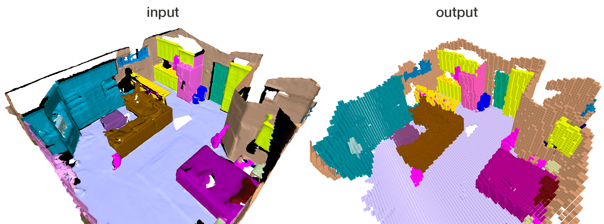

Classy Voxelizer
====
Voxelizes or uniformly samples a mesh at a given `voxel_size` using a face-splitting algorithm. Classy Voxelizer is designed to correctly handle meshes where each point in the underlying cloud is associated to a (semantic) class, either by its color or a label property.   

### Example:
A mesh (source: [ScanNet](http://www.scan-net.org/)) where each point's color represents a semantic class.



### Class Mappings:

1. `color`: for meshes where a point's color associates it to a (semantic) class.
2. `labels`: for meshes containing a 'label' attribute per point
3. `none`: for meshes where color attributes represent the actual appearance of that point

### Build:
```
mkdir build && cd build
cmake -DCMAKE_BUILD_TYPE=Release ..
make
```

### Usage:

`./classy_voxelizer <input_filename> <output_filename> <voxel_size> <class_mapping> <voxelize>`

The `voxelize` flag (true/false) specifies whether the output cloud shall contain points representing empty-space (a voxelization) or only points lying in occupied space (a uniform sampling).


### Notes:
* Reads ASCII/binary PLY, writes binary PLY (thanks to [tinyply](https://github.com/ddiakopoulos/tinyply))
* <voxel_size> argument in meters
* Requires Eigen3


### License:
[BSD 2-Clause License](LICENSE)